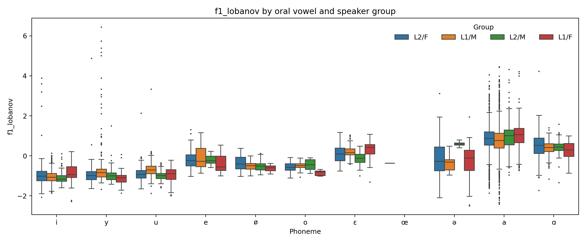
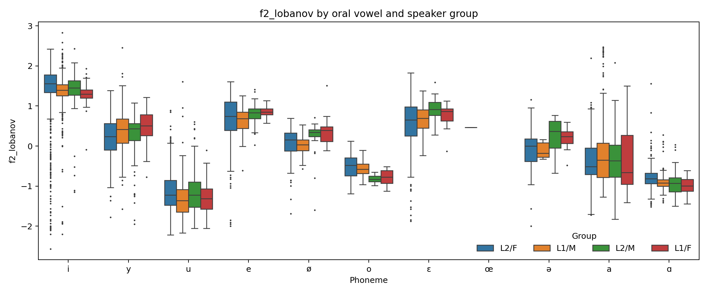
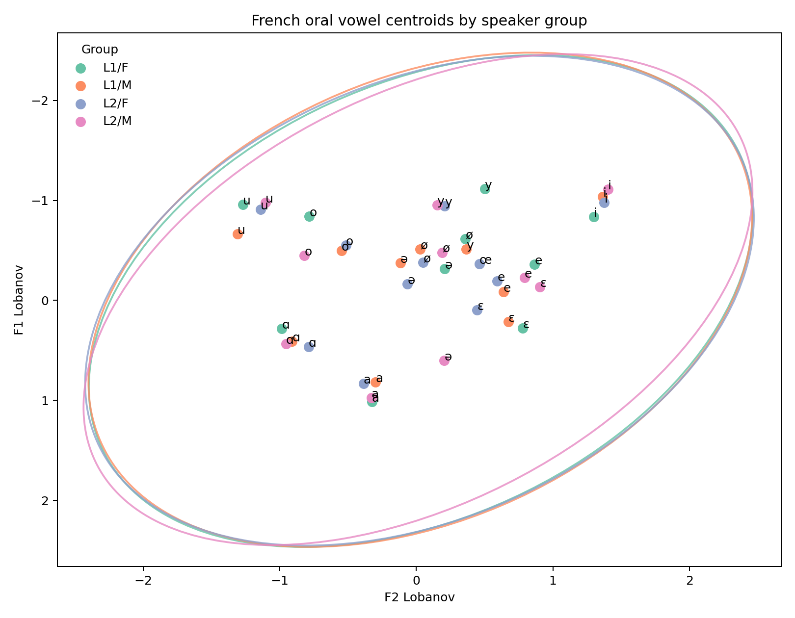
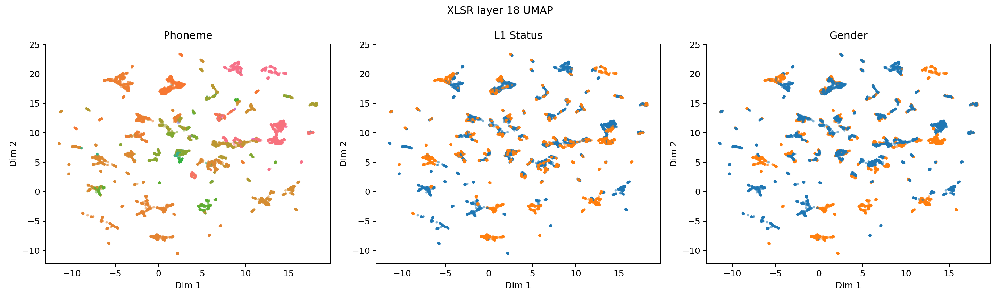
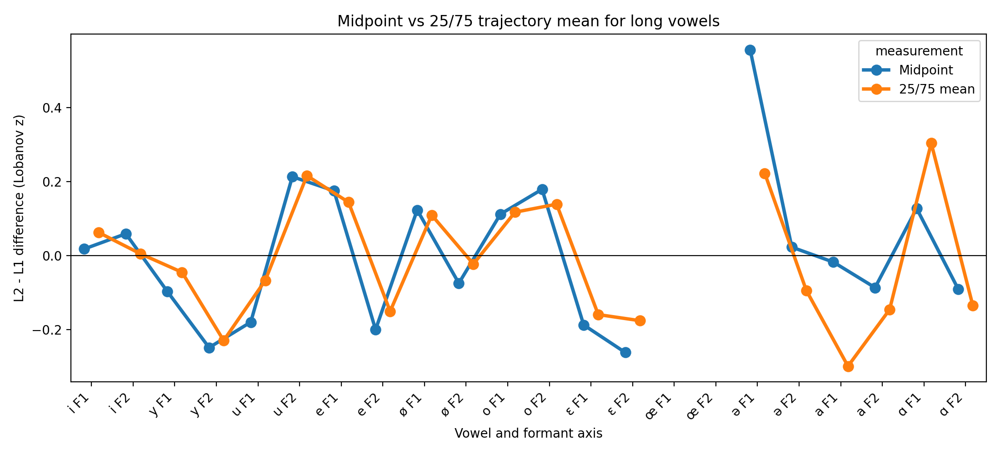
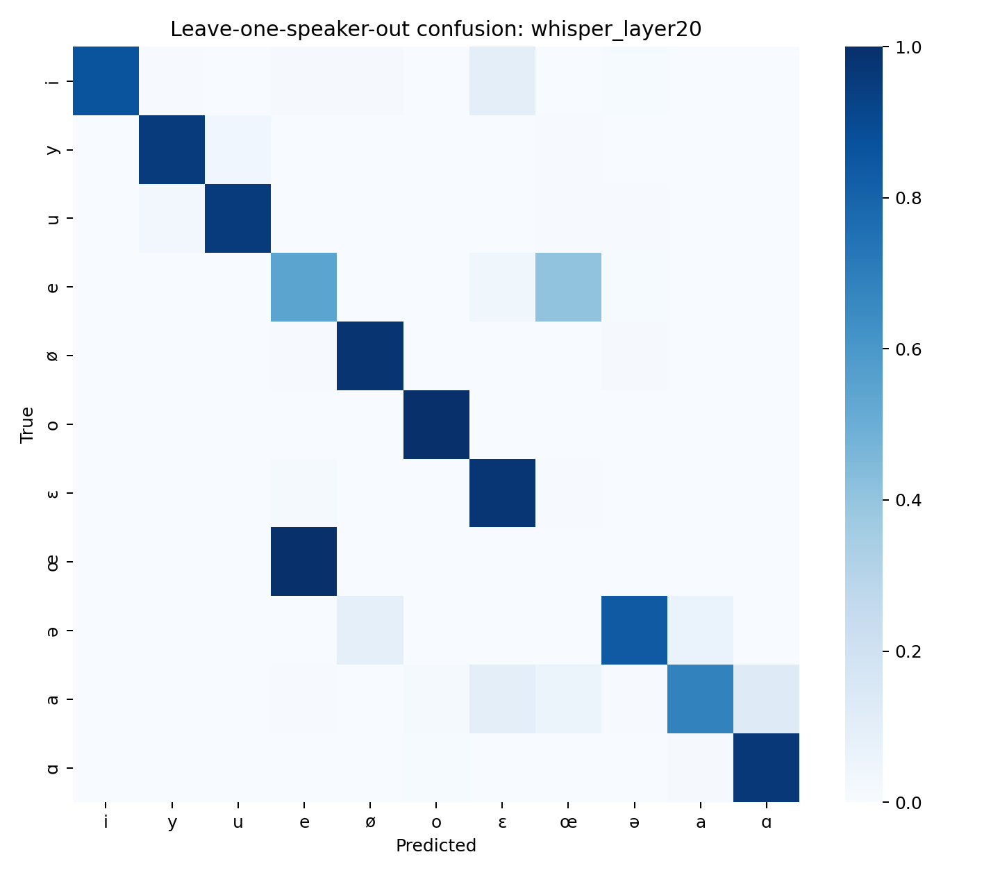
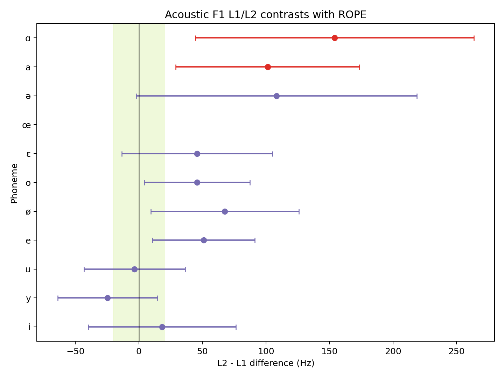
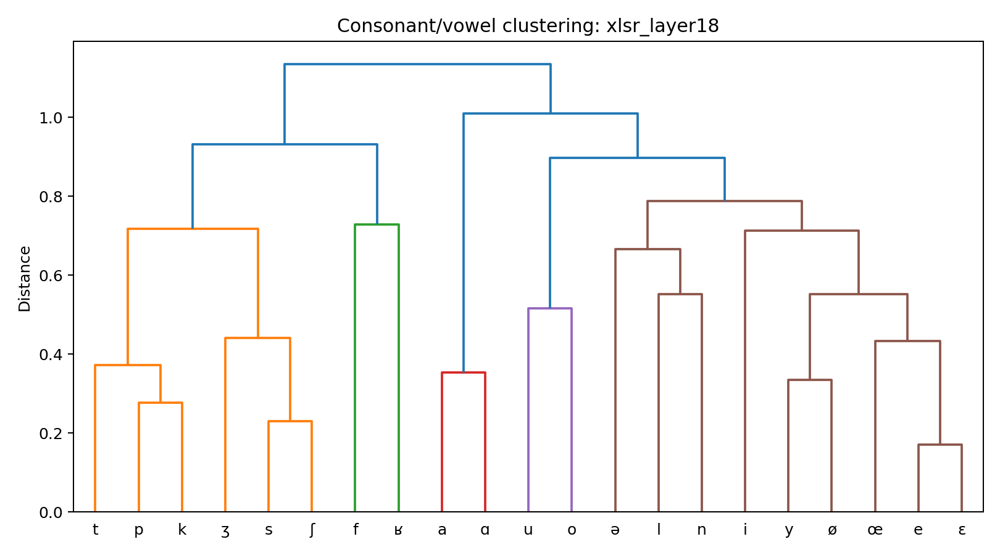
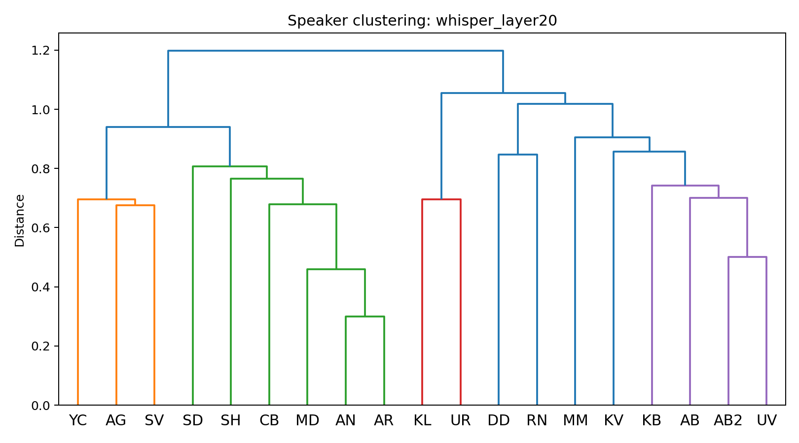
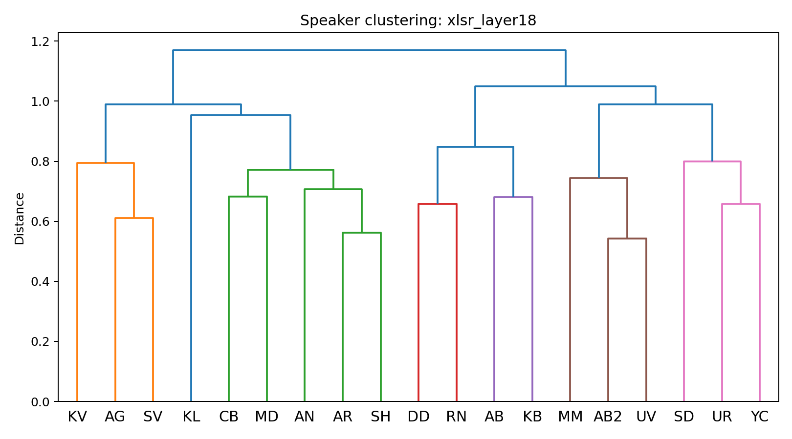

# Acoustic and Neural Representations in a Phonetically Aligned Corpus

## Overview

This project asks how far acoustic measurements and neural speech representations tell the same story about phonetic structure in the Russian-French Interference Corpus. I treated the corpus as a phoneme-level dataset: TextGrid intervals were converted into token rows, acoustic descriptors were measured at aligned intervals, Whisper and XLS-R hidden states were averaged over the same intervals, and the resulting representations were compared with descriptive, inferential, and clustering analyses.

## Pipeline Outputs

Main data products:

- `data/phoneme_tokens.csv`
- `data/features_acoustic.csv`
- `data/features_acoustic_norm.csv`
- `data/features_whisper.npz`
- `data/features_whisper_pca.npz`
- `data/features_xlsr.npz`
- `data/features_xlsr_pca.npz`

Main result folders:

- `results/tables/`
- `results/figures/`

## Methods and Data Quality

After parsing, the working dataset contained 22919 phoneme tokens from 19 speakers and 78 sentence IDs. Acoustic extraction used Praat/parselmouth Burg LPC formants with `max_number_of_formants = 5`. The maximum formant was 5000 Hz for female speakers and 4500 Hz for male speakers. F1-F3 were measured at each phoneme midpoint; for vowels longer than 80 ms, F1-F3 were also measured at 25% and 75% of the interval. Formants were Lobanov-normalised within speaker, using vowel tokens only, so that speaker differences in vocal-tract scale did not dominate the vowel comparisons.

For the neural analyses, I extracted `openai/whisper-medium` layers 6, 20 and `facebook/wav2vec2-large-xlsr-53` layers 3, 9, 18. Each selected layer was reduced to 50 principal components before downstream modelling. Permutation tests used 5000 permutations, and bootstrap/ROPE summaries used 2000 resamples where applicable.

Missing-value summary by analysis-relevant token set:

- **missingness 1**
  - `feature`: f1_hz
  - `n_tokens_considered`: 8277
  - `missing_prop`: 0.000
- **missingness 2**
  - `feature`: f2_hz
  - `n_tokens_considered`: 8277
  - `missing_prop`: 0.000
- **missingness 3**
  - `feature`: f3_hz
  - `n_tokens_considered`: 8277
  - `missing_prop`: 0.000
- **missingness 4**
  - `feature`: f0_mean_hz
  - `n_tokens_considered`: 8277
  - `missing_prop`: 0.047
- **missingness 5**
  - `feature`: scg_hz
  - `n_tokens_considered`: 5701
  - `missing_prop`: 0.000
- **missingness 6**
  - `feature`: f1_25_hz
  - `n_tokens_considered`: 5688
  - `missing_prop`: 0.000
- **missingness 7**
  - `feature`: f2_25_hz
  - `n_tokens_considered`: 5688
  - `missing_prop`: 0.000
- **missingness 8**
  - `feature`: f1_75_hz
  - `n_tokens_considered`: 5688
  - `missing_prop`: 0.000
- **missingness 9**
  - `feature`: f2_75_hz
  - `n_tokens_considered`: 5688
  - `missing_prop`: 0.000

Rough acoustic range flags:

- **quality 1**
  - `subset`: all_tokens
  - `feature`: f1_hz
  - `rough_low`: 100.000
  - `rough_high`: 1200.000
  - `n_tokens`: 22919
  - `n_nonmissing`: 22919
  - `n_flagged`: 1461
  - `flagged_prop_nonmissing`: 0.064
  - `min_value`: 83.732
  - `max_value`: 2645.505
- **quality 2**
  - `subset`: all_tokens
  - `feature`: f2_hz
  - `rough_low`: 300.000
  - `rough_high`: 4000.000
  - `n_tokens`: 22919
  - `n_nonmissing`: 22919
  - `n_flagged`: 4
  - `flagged_prop_nonmissing`: 0.000
  - `min_value`: 259.598
  - `max_value`: 3455.790
- **quality 3**
  - `subset`: all_tokens
  - `feature`: f0_mean_hz
  - `rough_low`: 50.000
  - `rough_high`: 500.000
  - `n_tokens`: 22919
  - `n_nonmissing`: 15915
  - `n_flagged`: 329
  - `flagged_prop_nonmissing`: 0.021
  - `min_value`: 74.985
  - `max_value`: 598.823
- **quality 4**
  - `subset`: oral_vowels
  - `feature`: f1_hz
  - `rough_low`: 100.000
  - `rough_high`: 1200.000
  - `n_tokens`: 8277
  - `n_nonmissing`: 8277
  - `n_flagged`: 16
  - `flagged_prop_nonmissing`: 0.002
  - `min_value`: 94.951
  - `max_value`: 1535.469
- **quality 5**
  - `subset`: oral_vowels
  - `feature`: f2_hz
  - `rough_low`: 300.000
  - `rough_high`: 4000.000
  - `n_tokens`: 8277
  - `n_nonmissing`: 8277
  - `n_flagged`: 1
  - `flagged_prop_nonmissing`: 0.000
  - `min_value`: 297.691
  - `max_value`: 3051.938
- **quality 6**
  - `subset`: oral_vowels
  - `feature`: f0_mean_hz
  - `rough_low`: 50.000
  - `rough_high`: 500.000
  - `n_tokens`: 8277
  - `n_nonmissing`: 7892
  - `n_flagged`: 32
  - `flagged_prop_nonmissing`: 0.004
  - `min_value`: 75.100
  - `max_value`: 584.773

I did not impute missing acoustic values. Instead, each analysis uses the available tokens for the feature being tested, and the corresponding result tables report the relevant sample sizes. Rough-range values were kept in the main analysis but tracked as quality diagnostics; among oral vowels, the flagged counts were F1 = 16, F2 = 1, and f0 = 32.

Missingness by phoneme class and speaker group is reported in `results/tables/acoustic_missingness_by_phoneme_group.csv`.

As a robustness check, I reran the acoustic L1/L2 tests after excluding rough-range F1/F2 values. This changed 0 of 22 FDR-significance decisions. The affected or filtered contrasts were:

- **sensitivity 1**
  - `phoneme_label`: y
  - `feature`: f1_lobanov
  - `n_l1_main`: 273
  - `n_l2_main`: 265
  - `difference_l2_minus_l1_main`: -0.303
  - `p_fdr_bh_main`: 0.001
  - `significant_fdr_0_05_main`: True
  - `n_l1_range_filtered`: 270
  - `n_l2_range_filtered`: 264
  - `difference_l2_minus_l1_range_filtered`: -0.254
  - `p_fdr_bh_range_filtered`: 0.001
  - `significant_fdr_0_05_range_filtered`: True
  - `n_excluded_by_range_filter`: 4
  - `conclusion_changed`: False
  - `absolute_effect_change`: 0.049
- **sensitivity 2**
  - `phoneme_label`: ə
  - `feature`: f1_lobanov
  - `n_l1_main`: 30
  - `n_l2_main`: 87
  - `difference_l2_minus_l1_main`: 0.207
  - `p_fdr_bh_main`: 0.413
  - `significant_fdr_0_05_main`: False
  - `n_l1_range_filtered`: 30
  - `n_l2_range_filtered`: 86
  - `difference_l2_minus_l1_range_filtered`: 0.169
  - `p_fdr_bh_range_filtered`: 0.485
  - `significant_fdr_0_05_range_filtered`: False
  - `n_excluded_by_range_filter`: 1
  - `conclusion_changed`: False
  - `absolute_effect_change`: 0.038
- **sensitivity 3**
  - `phoneme_label`: i
  - `feature`: f1_lobanov
  - `n_l1_main`: 910
  - `n_l2_main`: 962
  - `difference_l2_minus_l1_main`: -0.011
  - `p_fdr_bh_main`: 0.283
  - `significant_fdr_0_05_main`: False
  - `n_l1_range_filtered`: 910
  - `n_l2_range_filtered`: 960
  - `difference_l2_minus_l1_range_filtered`: -0.021
  - `p_fdr_bh_range_filtered`: 0.244
  - `significant_fdr_0_05_range_filtered`: False
  - `n_excluded_by_range_filter`: 2
  - `conclusion_changed`: False
  - `absolute_effect_change`: 0.010
- **sensitivity 4**
  - `phoneme_label`: ɑ
  - `feature`: f1_lobanov
  - `n_l1_main`: 608
  - `n_l2_main`: 399
  - `difference_l2_minus_l1_main`: 0.074
  - `p_fdr_bh_main`: 0.007
  - `significant_fdr_0_05_main`: True
  - `n_l1_range_filtered`: 608
  - `n_l2_range_filtered`: 398
  - `difference_l2_minus_l1_range_filtered`: 0.064
  - `p_fdr_bh_range_filtered`: 0.008
  - `significant_fdr_0_05_range_filtered`: True
  - `n_excluded_by_range_filter`: 1
  - `conclusion_changed`: False
  - `absolute_effect_change`: 0.009
- **sensitivity 5**
  - `phoneme_label`: a
  - `feature`: f1_lobanov
  - `n_l1_main`: 1336
  - `n_l2_main`: 1763
  - `difference_l2_minus_l1_main`: -0.003
  - `p_fdr_bh_main`: 0.074
  - `significant_fdr_0_05_main`: False
  - `n_l1_range_filtered`: 1336
  - `n_l2_range_filtered`: 1755
  - `difference_l2_minus_l1_range_filtered`: -0.013
  - `p_fdr_bh_range_filtered`: 0.107
  - `significant_fdr_0_05_range_filtered`: False
  - `n_excluded_by_range_filter`: 8
  - `conclusion_changed`: False
  - `absolute_effect_change`: 0.009
- **sensitivity 6**
  - `phoneme_label`: i
  - `feature`: f2_lobanov
  - `n_l1_main`: 910
  - `n_l2_main`: 962
  - `difference_l2_minus_l1_main`: 0.032
  - `p_fdr_bh_main`: 0.000
  - `significant_fdr_0_05_main`: True
  - `n_l1_range_filtered`: 910
  - `n_l2_range_filtered`: 961
  - `difference_l2_minus_l1_range_filtered`: 0.035
  - `p_fdr_bh_range_filtered`: 0.000
  - `significant_fdr_0_05_range_filtered`: True
  - `n_excluded_by_range_filter`: 1
  - `conclusion_changed`: False
  - `absolute_effect_change`: 0.004

## Supplementary outputs and result index

The PDF report gives the main results needed to answer the project questions. Full result tables and supporting figures are included in the submitted folder so that every reported decision can be checked without relying on prose alone.

- `results/tables/acoustic_missingness_by_phoneme_group.csv`
  - missing acoustic-value proportions by phoneme, L1/L2 group and gender.
- `results/tables/acoustic_vowel_descriptives.csv`
  - complete vowel-level acoustic descriptives by speaker group, including mean, median, SD, IQR and CV for F1/F2.
- `results/tables/acoustic_f1_variance_decomposition.csv`
  - per-vowel decomposition of F1 variation into total, inter-speaker and intra-speaker components.
- `results/tables/acoustic_l1_l2_tests.csv`
  - full acoustic L1/L2 vowel tests with raw p-values and BH-FDR adjusted p-values.
- `results/tables/gender_residual_tests.csv`
  - speaker-level residual gender tests after Lobanov normalisation.
- `results/tables/neural_l1_l2_permutation_whisper_layer20.csv`
  - Whisper layer 20 L1/L2 permutation tests for vowel contrasts.
- `results/tables/neural_l1_l2_permutation_xlsr_layer18.csv`
  - XLS-R layer 18 L1/L2 permutation tests for vowel contrasts.
- `results/tables/neural_projection_metrics.csv`
  - PCA/UMAP projection diagnostics for all tested neural layers.
- `results/tables/rsm_mantel_sample.csv`
  - sampled representational similarity correlations across acoustic, Whisper and XLS-R token distances.
- `results/tables/phoneme_distance_mantel.csv`
  - Mantel correlations between phoneme-centroid distance matrices.
- `results/tables/selected_pair_distance_bootstrap_ci.csv`
  - speaker-level bootstrap confidence intervals for selected phoneme-pair distances.
- `results/tables/phoneme_identification_metrics.csv`
  - overall and group-specific nearest-centroid identification metrics.
- `results/tables/phoneme_identification_mcnemar.csv`
  - matched-pair McNemar comparisons between identification systems.
- `results/tables/mixed_model_comparisons.csv`
  - null, main-effects, interaction, extended and likelihood-ratio model-comparison sequence.
- `results/tables/mixed_model_fixed_effects.csv`
  - fixed-effect estimates from the extended mixed-effects models.
- `results/tables/mixed_model_icc_a.csv`
  - speaker ICC estimates for /a/ in acoustic, Whisper and XLS-R responses.
- `results/tables/mixed_model_random_slope_note.csv`
  - documentation of why the by-speaker L1 random slope was not fitted.
- `results/tables/mixed_model_representation_r2_summary.csv`
  - marginal and conditional R2 summaries by representation.
- `results/tables/rope_acoustic_contrasts.csv`
  - full acoustic ROPE contrast table for F1/F2 in Hz.
- `results/tables/rope_neural_contrasts_whisper_layer20.csv`
  - Whisper layer 20 contrast-level ROPE classifications.
- `results/tables/rope_neural_contrasts_xlsr_layer18.csv`
  - XLS-R layer 18 contrast-level ROPE classifications.
- `results/tables/rope_summary.csv`
  - combined ROPE summary used in the main text.
- `results/tables/clustering_vowel_ari.csv`
  - vowel clustering metrics, linkage choices, silhouettes and ARI values.
- `results/tables/clustering_consonant_vowel_ari.csv`
  - consonant/vowel clustering ARI and silhouette metrics.
- `results/tables/clustering_speaker_ari.csv`
  - speaker clustering results against L1/L2 and gender labels.

## Descriptive Statistics

The descriptive stage is documented in three layers. The main text reports the most important summaries; the full supporting files are:

- `results/tables/acoustic_vowel_descriptives.csv`
  - Full mean, median, SD, IQR and CV by vowel and speaker group.
- `results/tables/acoustic_f1_variance_decomposition.csv`
  - F1 variance decomposition by vowel.
- `results/figures/intra_speaker_variability_violin.png`
  - Intra-speaker variability figure.

For neural representations, `results/tables/neural_projection_metrics.csv` gives PCA/UMAP diagnostics for all tested layers. The submitted projection figures are:

- `results/figures/whisper_layer_6_pca2.png`
- `results/figures/whisper_layer_6_umap2.png`
- `results/figures/whisper_layer_20_pca2.png`
- `results/figures/whisper_layer_20_umap2.png`
- `results/figures/xlsr_layer_3_pca2.png`
- `results/figures/xlsr_layer_3_umap2.png`
- `results/figures/xlsr_layer_9_pca2.png`
- `results/figures/xlsr_layer_9_umap2.png`
- `results/figures/xlsr_layer_18_pca2.png`
- `results/figures/xlsr_layer_18_umap2.png`

The largest 2D between-phoneme variance ratios were:

- **projection 1**
  - `model`: xlsr
  - `layer`: 18
  - `method`: pca
  - `between_phoneme_variance_ratio_2d`: 0.849
  - `within_phoneme_cosine_mean`: 0.825
  - `between_phoneme_cosine_mean`: 0.150
  - `within_between_similarity_ratio`: 5.500
  - `similarity_sample_pairs`: 20000
- **projection 2**
  - `model`: whisper
  - `layer`: 6
  - `method`: pca
  - `between_phoneme_variance_ratio_2d`: 0.818
  - `within_phoneme_cosine_mean`: 0.770
  - `between_phoneme_cosine_mean`: 0.104
  - `within_between_similarity_ratio`: 7.424
  - `similarity_sample_pairs`: 20000
- **projection 3**
  - `model`: xlsr
  - `layer`: 18
  - `method`: umap
  - `between_phoneme_variance_ratio_2d`: 0.816
  - `within_phoneme_cosine_mean`: 0.933
  - `between_phoneme_cosine_mean`: 0.765
  - `within_between_similarity_ratio`: 1.220
  - `similarity_sample_pairs`: 20000
- **projection 4**
  - `model`: xlsr
  - `layer`: 3
  - `method`: pca
  - `between_phoneme_variance_ratio_2d`: 0.805
  - `within_phoneme_cosine_mean`: 0.804
  - `between_phoneme_cosine_mean`: 0.120
  - `within_between_similarity_ratio`: 6.676
  - `similarity_sample_pairs`: 20000
- **projection 5**
  - `model`: xlsr
  - `layer`: 3
  - `method`: umap
  - `between_phoneme_variance_ratio_2d`: 0.769
  - `within_phoneme_cosine_mean`: 0.979
  - `between_phoneme_cosine_mean`: 0.878
  - `within_between_similarity_ratio`: 1.116
  - `similarity_sample_pairs`: 20000

Sampled RSM correlations:

- **rsm 1**
  - `representation_a`: acoustic
  - `representation_b`: whisper_layer20
  - `spearman_mantel_r`: 0.189
  - `p_value_asymptotic`: 0.000
  - `n_tokens_sampled`: 3000
  - `n_pairwise_values`: 4498500
- **rsm 2**
  - `representation_a`: acoustic
  - `representation_b`: xlsr_layer18
  - `spearman_mantel_r`: 0.355
  - `p_value_asymptotic`: 0.000
  - `n_tokens_sampled`: 3000
  - `n_pairwise_values`: 4498500
- **rsm 3**
  - `representation_a`: whisper_layer20
  - `representation_b`: xlsr_layer18
  - `spearman_mantel_r`: 0.676
  - `p_value_asymptotic`: 0.000
  - `n_tokens_sampled`: 3000
  - `n_pairwise_values`: 4498500

## Statistical Tests

The complete vowel-level acoustic tests are in `results/tables/acoustic_l1_l2_tests.csv`; this table includes the test used for each contrast and the BH-FDR correction. After BH-FDR correction, 9 of 22 acoustic vowel-feature contrasts were significant: /i/ f2, /y/ f1, /y/ f2, /u/ f1, /u/ f2, /ø/ f1, /ɛ/ f1, /ɑ/ f1, /ɑ/ f2.

Neural L1/L2 permutation tests are reported in `results/tables/neural_l1_l2_permutation_whisper_layer20.csv` and `results/tables/neural_l1_l2_permutation_xlsr_layer18.csv`. Whisper layer 20 had 9 of 11 vowel contrasts significant after BH-FDR correction (/i/, /y/, /u/, /e/, /ø/, /o/, /ɛ/, /a/, /ɑ/); XLS-R layer 18 also had 9 of 11 significant contrasts (/i/, /y/, /u/, /e/, /ø/, /o/, /ɛ/, /a/, /ɑ/).

Phoneme-centroid distance Mantel correlations:

- **distance 1**
  - `distance_a`: acoustic_euclidean
  - `distance_b`: acoustic_mahalanobis
  - `mantel_spearman_r`: 0.984
  - `p_value_asymptotic`: 0.000
  - `n_phoneme_pairs`: 55
- **distance 2**
  - `distance_a`: acoustic_euclidean
  - `distance_b`: whisper_cosine
  - `mantel_spearman_r`: 0.674
  - `p_value_asymptotic`: 0.000
  - `n_phoneme_pairs`: 55
- **distance 3**
  - `distance_a`: acoustic_euclidean
  - `distance_b`: xlsr_cosine
  - `mantel_spearman_r`: 0.678
  - `p_value_asymptotic`: 0.000
  - `n_phoneme_pairs`: 55
- **distance 4**
  - `distance_a`: acoustic_mahalanobis
  - `distance_b`: whisper_cosine
  - `mantel_spearman_r`: 0.672
  - `p_value_asymptotic`: 0.000
  - `n_phoneme_pairs`: 55
- **distance 5**
  - `distance_a`: acoustic_mahalanobis
  - `distance_b`: xlsr_cosine
  - `mantel_spearman_r`: 0.676
  - `p_value_asymptotic`: 0.000
  - `n_phoneme_pairs`: 55
- **distance 6**
  - `distance_a`: whisper_cosine
  - `distance_b`: xlsr_cosine
  - `mantel_spearman_r`: 0.842
  - `p_value_asymptotic`: 0.000
  - `n_phoneme_pairs`: 55

Residual gender-effect tests after Lobanov normalisation are reported in `results/tables/gender_residual_tests.csv`. They found 0 FDR-significant acoustic contrasts at alpha = 0.05.

## Midpoint vs Trajectory

For long vowels with available 25% and 75% formant measurements, midpoint-based L1/L2 conclusions were compared with trajectory-mean conclusions on the same subset of tokens. 6 of 22 FDR-significance decisions changed.

Largest changes in L2-L1 effect size:

- **trajectory 1**
  - `phoneme_label`: ə
  - `axis`: F1
  - `n_l1`: 16
  - `n_l2`: 60
  - `midpoint_difference_l2_minus_l1`: 0.557
  - `trajectory_difference_l2_minus_l1`: 0.223
  - `absolute_difference_change`: 0.334
  - `midpoint_p_fdr_bh`: 0.085
  - `trajectory_p_fdr_bh`: 0.574
  - `midpoint_significant_fdr_0_05`: False
  - `trajectory_significant_fdr_0_05`: False
  - `conclusion_changed`: False
- **trajectory 2**
  - `phoneme_label`: a
  - `axis`: F1
  - `n_l1`: 887
  - `n_l2`: 1562
  - `midpoint_difference_l2_minus_l1`: -0.018
  - `trajectory_difference_l2_minus_l1`: -0.299
  - `absolute_difference_change`: 0.281
  - `midpoint_p_fdr_bh`: 1.000
  - `trajectory_p_fdr_bh`: 0.000
  - `midpoint_significant_fdr_0_05`: False
  - `trajectory_significant_fdr_0_05`: True
  - `conclusion_changed`: True
- **trajectory 3**
  - `phoneme_label`: ɑ
  - `axis`: F1
  - `n_l1`: 15
  - `n_l2`: 106
  - `midpoint_difference_l2_minus_l1`: 0.128
  - `trajectory_difference_l2_minus_l1`: 0.304
  - `absolute_difference_change`: 0.176
  - `midpoint_p_fdr_bh`: 0.811
  - `trajectory_p_fdr_bh`: 0.043
  - `midpoint_significant_fdr_0_05`: False
  - `trajectory_significant_fdr_0_05`: True
  - `conclusion_changed`: True
- **trajectory 4**
  - `phoneme_label`: ə
  - `axis`: F2
  - `n_l1`: 16
  - `n_l2`: 60
  - `midpoint_difference_l2_minus_l1`: 0.023
  - `trajectory_difference_l2_minus_l1`: -0.094
  - `absolute_difference_change`: 0.117
  - `midpoint_p_fdr_bh`: 0.866
  - `trajectory_p_fdr_bh`: 0.487
  - `midpoint_significant_fdr_0_05`: False
  - `trajectory_significant_fdr_0_05`: False
  - `conclusion_changed`: False
- **trajectory 5**
  - `phoneme_label`: u
  - `axis`: F1
  - `n_l1`: 210
  - `n_l2`: 308
  - `midpoint_difference_l2_minus_l1`: -0.180
  - `trajectory_difference_l2_minus_l1`: -0.067
  - `absolute_difference_change`: 0.113
  - `midpoint_p_fdr_bh`: 0.000
  - `trajectory_p_fdr_bh`: 0.000
  - `midpoint_significant_fdr_0_05`: True
  - `trajectory_significant_fdr_0_05`: True
  - `conclusion_changed`: False

## Inter-phoneme Distances and Classification

The Mantel summaries above compare complete phoneme-centroid distance matrices. `results/tables/selected_pair_distance_bootstrap_ci.csv` adds speaker-level bootstrap confidence intervals for selected phoneme pairs; the first rows are:

- **pair 1**
  - `pair`: e-ɛ
  - `representation`: acoustic_euclidean
  - `distance_mean`: 0.311
  - `ci95_low`: 0.219
  - `ci95_high`: 0.402
  - `n_bootstrap`: 1000
- **pair 2**
  - `pair`: e-ɛ
  - `representation`: acoustic_mahalanobis
  - `distance_mean`: 0.523
  - `ci95_low`: 0.354
  - `ci95_high`: 0.694
  - `n_bootstrap`: 1000
- **pair 3**
  - `pair`: e-ɛ
  - `representation`: whisper_layer20
  - `distance_mean`: 0.512
  - `ci95_low`: 0.479
  - `ci95_high`: 0.543
  - `n_bootstrap`: 1000
- **pair 4**
  - `pair`: e-ɛ
  - `representation`: xlsr_layer18
  - `distance_mean`: 0.172
  - `ci95_low`: 0.155
  - `ci95_high`: 0.190
  - `n_bootstrap`: 1000
- **pair 5**
  - `pair`: y-u
  - `representation`: acoustic_euclidean
  - `distance_mean`: 1.507
  - `ci95_low`: 1.393
  - `ci95_high`: 1.617
  - `n_bootstrap`: 1000
- **pair 6**
  - `pair`: y-u
  - `representation`: acoustic_mahalanobis
  - `distance_mean`: 2.953
  - `ci95_low`: 2.738
  - `ci95_high`: 3.173
  - `n_bootstrap`: 1000
- **pair 7**
  - `pair`: y-u
  - `representation`: whisper_layer20
  - `distance_mean`: 0.461
  - `ci95_low`: 0.420
  - `ci95_high`: 0.501
  - `n_bootstrap`: 1000
- **pair 8**
  - `pair`: y-u
  - `representation`: xlsr_layer18
  - `distance_mean`: 0.441
  - `ci95_low`: 0.399
  - `ci95_high`: 0.487
  - `n_bootstrap`: 1000

Nearest-centroid classification results are in `results/tables/phoneme_identification_metrics.csv`. The table includes overall metrics and, where present, separate L1/L2 rows:

- **classifier 1**
  - `representation`: acoustic
  - `overall_accuracy`: 0.687
  - `macro_f1`: 0.467
  - `n_tokens`: 8277
  - `group`: overall
- **classifier 2**
  - `representation`: acoustic
  - `overall_accuracy`: 0.710
  - `macro_f1`: 0.502
  - `n_tokens`: 3913
  - `group`: L1
- **classifier 3**
  - `representation`: acoustic
  - `overall_accuracy`: 0.667
  - `macro_f1`: 0.428
  - `n_tokens`: 4364
  - `group`: L2
- **classifier 4**
  - `representation`: whisper_layer20
  - `overall_accuracy`: 0.823
  - `macro_f1`: 0.735
  - `n_tokens`: 8277
  - `group`: overall
- **classifier 5**
  - `representation`: whisper_layer20
  - `overall_accuracy`: 0.870
  - `macro_f1`: 0.772
  - `n_tokens`: 3913
  - `group`: L1
- **classifier 6**
  - `representation`: whisper_layer20
  - `overall_accuracy`: 0.780
  - `macro_f1`: 0.708
  - `n_tokens`: 4364
  - `group`: L2
- **classifier 7**
  - `representation`: xlsr_layer18
  - `overall_accuracy`: 0.790
  - `macro_f1`: 0.708
  - `n_tokens`: 8277
  - `group`: overall
- **classifier 8**
  - `representation`: xlsr_layer18
  - `overall_accuracy`: 0.799
  - `macro_f1`: 0.688
  - `n_tokens`: 3913
  - `group`: L1
- **classifier 9**
  - `representation`: xlsr_layer18
  - `overall_accuracy`: 0.782
  - `macro_f1`: 0.721
  - `n_tokens`: 4364
  - `group`: L2

The best phoneme identification accuracy was obtained by `whisper_layer20` with accuracy 0.823.

Matched-pair classifier comparisons are reported in `results/tables/phoneme_identification_mcnemar.csv`. In that table, 3 of 3 McNemar tests have p < 0.05:

- **mcnemar 1**
  - `representation_a`: acoustic
  - `representation_b`: whisper_layer20
  - `both_correct`: 4934
  - `a_correct_b_wrong`: 756
  - `a_wrong_b_correct`: 1874
  - `both_wrong`: 713
  - `statistic`: 474.406
  - `p_value`: 0.000
- **mcnemar 2**
  - `representation_a`: acoustic
  - `representation_b`: xlsr_layer18
  - `both_correct`: 4931
  - `a_correct_b_wrong`: 759
  - `a_wrong_b_correct`: 1610
  - `both_wrong`: 977
  - `statistic`: 304.981
  - `p_value`: 0.000
- **mcnemar 3**
  - `representation_a`: whisper_layer20
  - `representation_b`: xlsr_layer18
  - `both_correct`: 6048
  - `a_correct_b_wrong`: 760
  - `a_wrong_b_correct`: 493
  - `both_wrong`: 976
  - `statistic`: 56.469
  - `p_value`: 0.000

## Mixed-Effects Models

`results/tables/mixed_model_comparisons.csv` reports the null, main-effects, full-interaction and extended model-building sequence, together with likelihood-ratio comparisons. These nested model comparisons were fitted with maximum likelihood rather than REML in the analysis code. A compact excerpt is:

- **model 1**
  - `representation`: acoustic
  - `response`: f1_lobanov
  - `comparison`: null_model_vs_main_effects
  - `lr_statistic`: 0.000
  - `raw_lr_statistic`: -5.851
  - `lrt_note`: optimizer_nonmonotonic
  - `df`: 2.000
  - `p_value`: 1.000
- **model 2**
  - `representation`: acoustic
  - `response`: f1_lobanov
  - `comparison`: main_effects_vs_full_interaction
  - `lr_statistic`: 5.286
  - `raw_lr_statistic`: 5.286
  - `lrt_note`: overall
  - `df`: 1.000
  - `p_value`: 0.022
- **model 3**
  - `representation`: acoustic
  - `response`: f1_lobanov
  - `comparison`: full_interaction_vs_extended_height
  - `lr_statistic`: 7586.933
  - `raw_lr_statistic`: 7586.933
  - `lrt_note`: overall
  - `df`: 2.000
  - `p_value`: 0.000
- **model 4**
  - `representation`: acoustic
  - `response`: f2_lobanov
  - `comparison`: null_model_vs_main_effects
  - `lr_statistic`: 0.000
  - `raw_lr_statistic`: -6.584
  - `lrt_note`: optimizer_nonmonotonic
  - `df`: 2.000
  - `p_value`: 1.000
- **model 5**
  - `representation`: acoustic
  - `response`: f2_lobanov
  - `comparison`: main_effects_vs_full_interaction
  - `lr_statistic`: 7.610
  - `raw_lr_statistic`: 7.610
  - `lrt_note`: overall
  - `df`: 1.000
  - `p_value`: 0.006
- **model 6**
  - `representation`: acoustic
  - `response`: f2_lobanov
  - `comparison`: full_interaction_vs_extended_height
  - `lr_statistic`: 2510.152
  - `raw_lr_statistic`: 2510.152
  - `lrt_note`: overall
  - `df`: 2.000
  - `p_value`: 0.000
- **model 7**
  - `representation`: whisper_layer20
  - `response`: whisper_pc1
  - `comparison`: null_model_vs_main_effects
  - `lr_statistic`: 1.019
  - `raw_lr_statistic`: 1.019
  - `lrt_note`: overall
  - `df`: 2.000
  - `p_value`: 0.601
- **model 8**
  - `representation`: whisper_layer20
  - `response`: whisper_pc1
  - `comparison`: main_effects_vs_full_interaction
  - `lr_statistic`: 0.020
  - `raw_lr_statistic`: 0.020
  - `lrt_note`: overall
  - `df`: 1.000
  - `p_value`: 0.887
- **model 9**
  - `representation`: whisper_layer20
  - `response`: whisper_pc1
  - `comparison`: full_interaction_vs_extended_height
  - `lr_statistic`: 6339.167
  - `raw_lr_statistic`: 6339.167
  - `lrt_note`: overall
  - `df`: 2.000
  - `p_value`: 0.000
- **model 10**
  - `representation`: whisper_layer20
  - `response`: whisper_pc2
  - `comparison`: null_model_vs_main_effects
  - `lr_statistic`: 11.072
  - `raw_lr_statistic`: 11.072
  - `lrt_note`: overall
  - `df`: 2.000
  - `p_value`: 0.004
- **model 11**
  - `representation`: whisper_layer20
  - `response`: whisper_pc2
  - `comparison`: main_effects_vs_full_interaction
  - `lr_statistic`: 0.174
  - `raw_lr_statistic`: 0.174
  - `lrt_note`: overall
  - `df`: 1.000
  - `p_value`: 0.677
- **model 12**
  - `representation`: whisper_layer20
  - `response`: whisper_pc2
  - `comparison`: full_interaction_vs_extended_height
  - `lr_statistic`: 48.737
  - `raw_lr_statistic`: 48.737
  - `lrt_note`: overall
  - `df`: 2.000
  - `p_value`: 0.000

`results/tables/mixed_model_fixed_effects.csv` reports fixed-effect estimates from the extended models. The first rows are:

- **fixed 1**
  - `representation`: acoustic
  - `response`: f1_lobanov
  - `model`: extended_height
  - `term`: Intercept
  - `estimate`: -0.909
  - `std_error`: 0.023
  - `z_value`: -39.194
  - `p_value`: 0.000
- **fixed 2**
  - `representation`: acoustic
  - `response`: f1_lobanov
  - `model`: extended_height
  - `term`: C(vowel_height)[T.low]
  - `estimate`: 1.674
  - `std_error`: 0.015
  - `z_value`: 111.020
  - `p_value`: 0.000
- **fixed 3**
  - `representation`: acoustic
  - `response`: f1_lobanov
  - `model`: extended_height
  - `term`: C(vowel_height)[T.mid]
  - `estimate`: 0.746
  - `std_error`: 0.023
  - `z_value`: 32.884
  - `p_value`: 0.000
- **fixed 4**
  - `representation`: acoustic
  - `response`: f1_lobanov
  - `model`: extended_height
  - `term`: l2
  - `estimate`: -0.014
  - `std_error`: 0.024
  - `z_value`: -0.585
  - `p_value`: 0.559
- **fixed 5**
  - `representation`: acoustic
  - `response`: f1_lobanov
  - `model`: extended_height
  - `term`: male
  - `estimate`: -0.019
  - `std_error`: 0.024
  - `z_value`: -0.770
  - `p_value`: 0.441
- **fixed 6**
  - `representation`: acoustic
  - `response`: f1_lobanov
  - `model`: extended_height
  - `term`: l2:male
  - `estimate`: -0.009
  - `std_error`: 0.034
  - `z_value`: -0.266
  - `p_value`: 0.790
- **fixed 7**
  - `representation`: acoustic
  - `response`: f2_lobanov
  - `model`: extended_height
  - `term`: Intercept
  - `estimate`: 0.594
  - `std_error`: 0.031
  - `z_value`: 18.973
  - `p_value`: 0.000
- **fixed 8**
  - `representation`: acoustic
  - `response`: f2_lobanov
  - `model`: extended_height
  - `term`: C(vowel_height)[T.low]
  - `estimate`: -1.074
  - `std_error`: 0.020
  - `z_value`: -52.787
  - `p_value`: 0.000
- **fixed 9**
  - `representation`: acoustic
  - `response`: f2_lobanov
  - `model`: extended_height
  - `term`: C(vowel_height)[T.mid]
  - `estimate`: -0.284
  - `std_error`: 0.031
  - `z_value`: -9.273
  - `p_value`: 0.000
- **fixed 10**
  - `representation`: acoustic
  - `response`: f2_lobanov
  - `model`: extended_height
  - `term`: l2
  - `estimate`: -0.003
  - `std_error`: 0.032
  - `z_value`: -0.105
  - `p_value`: 0.916

`results/tables/mixed_model_random_slope_note.csv` documents the random-slope decision: L1/L2 status is constant within speaker, so a by-speaker random slope for L1 has no within-speaker variation.

ICC for /a/ is reported in `results/tables/mixed_model_icc_a.csv`:

- **icc 1**
  - `phoneme_label`: a
  - `representation`: acoustic
  - `response`: f1_lobanov
  - `n_obs`: 3099
  - `speaker_random_variance`: 0.023
  - `residual_variance`: 0.580
  - `icc`: 0.038
- **icc 2**
  - `phoneme_label`: a
  - `representation`: whisper_layer20
  - `response`: whisper_pc1
  - `n_obs`: 3099
  - `speaker_random_variance`: 0.567
  - `residual_variance`: 12.774
  - `icc`: 0.042
- **icc 3**
  - `phoneme_label`: a
  - `representation`: xlsr_layer18
  - `response`: xlsr_pc1
  - `n_obs`: 3099
  - `speaker_random_variance`: 19.351
  - `residual_variance`: 602.057
  - `icc`: 0.031

Marginal and conditional R2 are summarised in `results/tables/mixed_model_representation_r2_summary.csv`:

- **r2 1**
  - `representation`: acoustic
  - `mean_marginal_r2`: 0.430
  - `max_marginal_r2`: 0.600
  - `mean_conditional_r2`: 0.430
  - `n_responses`: 2
- **r2 2**
  - `representation`: xlsr_layer18
  - `mean_marginal_r2`: 0.410
  - `max_marginal_r2`: 0.694
  - `mean_conditional_r2`: 0.425
  - `n_responses`: 5
- **r2 3**
  - `representation`: whisper_layer20
  - `mean_marginal_r2`: 0.310
  - `max_marginal_r2`: 0.534
  - `mean_conditional_r2`: 0.316
  - `n_responses`: 5

The highest mean marginal R2 was obtained by `acoustic` with mean marginal R2 0.430.

## Confidence Intervals and ROPE

The full contrast-level ROPE classifications are in `results/tables/rope_acoustic_contrasts.csv`, `results/tables/rope_neural_contrasts_whisper_layer20.csv`, `results/tables/rope_neural_contrasts_xlsr_layer18.csv`, and the combined `results/tables/rope_summary.csv`. The corresponding forest plots are `results/figures/forest_acoustic_f1_rope.png`, `results/figures/forest_acoustic_f2_rope.png`, `results/figures/forest_whisper_layer20_rope.png`, and `results/figures/forest_xlsr_layer18_rope.png`.

ROPE classification counts:

- acoustic_f1: Indeterminate = 8
- acoustic_f1: Insufficient data = 1
- acoustic_f1: Non-equivalent = 2
- whisper_layer20: Equivalent = 10
- whisper_layer20: Insufficient data = 1
- xlsr_layer18: Equivalent = 6
- xlsr_layer18: Indeterminate = 4
- xlsr_layer18: Insufficient data = 1

Acoustic F1 used the default [-20, +20] Hz ROPE. Neural ROPEs used the intra-speaker cosine-distance noise floor. The acoustic CI implementation is a speaker-level interval approximation rather than a strict profile-likelihood interval, so ROPE classifications should be interpreted as transparent robustness summaries rather than exact profile-likelihood decisions.

## Hierarchical Clustering

Acoustic clustering used Euclidean distances with Ward linkage. Neural clustering used cosine distances with average linkage, as recorded in the clustering tables. This is a deliberate deviation from Ward for the neural spaces: Ward's criterion is Euclidean, so average linkage was used for cosine-based neural distances.

Vowel clustering:

- **vowel 1**
  - `analysis`: vowels
  - `representation`: acoustic
  - `metric`: euclidean
  - `linkage`: ward
  - `best_k_silhouette`: 3
  - `best_silhouette`: 0.458
  - `ari_height_k3`: 0.311
  - `ari_front_back_central_k4`: 0.120
  - `n_phonemes`: 11
- **vowel 2**
  - `analysis`: vowels
  - `representation`: whisper_layer20
  - `metric`: cosine
  - `linkage`: average
  - `best_k_silhouette`: 6
  - `best_silhouette`: 0.296
  - `ari_height_k3`: 0.499
  - `ari_front_back_central_k4`: -0.005
  - `n_phonemes`: 11
- **vowel 3**
  - `analysis`: vowels
  - `representation`: xlsr_layer18
  - `metric`: cosine
  - `linkage`: average
  - `best_k_silhouette`: 2
  - `best_silhouette`: 0.309
  - `ari_height_k3`: 0.115
  - `ari_front_back_central_k4`: 0.305
  - `n_phonemes`: 11

Consonant/vowel clustering:

- **cv 1**
  - `analysis`: consonant_vowel
  - `representation`: acoustic
  - `metric`: euclidean
  - `linkage`: ward
  - `k`: 2
  - `ari_consonant_vowel`: 0.487
  - `silhouette`: 0.402
  - `n_phonemes`: 21
- **cv 2**
  - `analysis`: consonant_vowel
  - `representation`: whisper_layer20
  - `metric`: cosine
  - `linkage`: average
  - `k`: 2
  - `ari_consonant_vowel`: -0.024
  - `silhouette`: 0.248
  - `n_phonemes`: 21
- **cv 3**
  - `analysis`: consonant_vowel
  - `representation`: xlsr_layer18
  - `metric`: cosine
  - `linkage`: average
  - `k`: 2
  - `ari_consonant_vowel`: 0.638
  - `silhouette`: 0.306
  - `n_phonemes`: 21

Speaker clustering:

- **speaker 1**
  - `analysis`: speakers
  - `representation`: acoustic
  - `metric`: euclidean
  - `linkage`: ward
  - `best_k_silhouette`: 3
  - `best_silhouette`: 0.117
  - `ari_l1_l2_k2`: 0.085
  - `ari_gender_k2`: 0.296
  - `n_speakers`: 19
- **speaker 2**
  - `analysis`: speakers
  - `representation`: whisper_layer20
  - `metric`: cosine
  - `linkage`: average
  - `best_k_silhouette`: 2
  - `best_silhouette`: 0.254
  - `ari_l1_l2_k2`: 1.000
  - `ari_gender_k2`: 0.296
  - `n_speakers`: 19
- **speaker 3**
  - `analysis`: speakers
  - `representation`: xlsr_layer18
  - `metric`: cosine
  - `linkage`: average
  - `best_k_silhouette`: 5
  - `best_silhouette`: 0.214
  - `ari_l1_l2_k2`: 0.296
  - `ari_gender_k2`: 1.000
  - `n_speakers`: 19

Best vowel-height recovery: `whisper_layer20` with ARI 0.499.
Best front/back/central recovery: `xlsr_layer18` with ARI 0.305.
Best consonant/vowel boundary recovery: `xlsr_layer18` with ARI 0.638.

Systematically difficult consonants included /l/, /n/, /ʁ/; the supporting counts are in `results/tables/clustering_consonant_vowel_misclustered.csv`.

## Answers to the 16 Questions

1. PCA and UMAP were useful in different ways. PCA gave a stable linear baseline for comparing layers and representations, while UMAP made local phoneme neighbourhoods easier to inspect visually. PCA axes are easier to compare across runs; UMAP is better treated as an exploratory projection rather than as a direct acoustic scale.
2. In the acoustic F1 variance decomposition, the largest inter-speaker components were for /ɑ/ (0.230), /ə/ (0.209), /y/ (0.121), and /ɛ/ (0.066). This variability is partly reflected in the neural spaces, but not as a one-to-one copy of the acoustic pattern, because the embeddings also contain contextual and speaker-related information.
3. The UMAP plots show clear phoneme neighbourhoods, especially for XLS-R layer 18, but they do not reproduce the IPA vowel trapezoid exactly. The neural space is therefore phonetically organised, but it is not simply an F1/F2 vowel chart in another form.
4. The Mantel correlation between the acoustic RSM and the Whisper RSM was r = 0.189. The acoustic-XLS-R RSM correlation was higher, r = 0.355. This suggests that XLS-R layer 18 is closer to the acoustic similarity structure than Whisper layer 20, although both neural-acoustic correlations are weaker than the Whisper-XLS-R correlation, r = 0.676.
5. In the acoustic tests, FDR-significant L1/L2 differences involved /i/, /y/, /u/, /ø/, /ɛ/, and /ɑ/. In both neural permutation-test tables, the significant vowels were /i/, /y/, /u/, /e/, /ø/, /o/, /ɛ/, /a/, and /ɑ/. The lists overlap for /i/, /y/, /u/, /ø/, /ɛ/, and /ɑ/, but the neural representations additionally flag /e/, /o/, and /a/; /œ/ is insufficient and /ə/ is not significant.
6. If the target is the IPA vowel trapezoid, the acoustic distance structure is the most directly interpretable because it is built from the formant dimensions that define vowel height and frontness/backness. The acoustic Euclidean and Mahalanobis rankings were almost identical (r = 0.984). The neural distances were moderately aligned with acoustic distance (acoustic-Whisper r = 0.674; acoustic-XLS-R r = 0.678), but Whisper and XLS-R were closer to each other (r = 0.842), suggesting that the neural spaces capture phonological structure plus model-specific information rather than the trapezoid alone.
7. Whisper layer 20 yielded the highest overall phoneme identification accuracy, 0.823, followed by XLS-R layer 18 at 0.790 and the acoustic baseline at 0.687. The neural advantage appears in both groups, but not identically: Whisper improved more over acoustic for L1 speakers (0.870 vs 0.710) than for L2 speakers (0.780 vs 0.667), while XLS-R was similar across groups (0.799 for L1 and 0.782 for L2).
8. For /a/, the ICC for acoustic F1 was 0.038 and the ICC for Whisper PC1 was 0.042. These are very similar and both small, suggesting that neither response is dominated by stable between-speaker differences for /a/. XLS-R PC1 was also small, ICC = 0.031.
9. The L1 x Gender interaction was significant in the acoustic model-building comparisons for both F1 (p = 0.022) and F2 (p = 0.006). The same interaction was not significant for Whisper PCs 1-5: all Whisper interaction p-values were above 0.37. This discrepancy suggests that the acoustic formant models detect a group-specific interaction that is not carried in the same way by the tested Whisper dimensions; the separate residual gender tests also found 0 FDR-significant acoustic contrasts, so the interaction should be read as model-specific rather than as a broad residual gender effect.
10. The acoustic representation had the highest mean marginal R2 for the L1/L2 fixed-effect models, 0.430. XLS-R layer 18 was close behind at 0.410, and Whisper layer 20 was lower at 0.310. This differs from the phoneme-identification task, where Whisper had the highest accuracy. In short, acoustic features explain the fixed-effect model structure best, while Whisper is best for classifying phoneme identity.
11. I did not find a phoneme whose acoustic F1 contrast was statistically significant and also classified as equivalent inside the acoustic ROPE. Several statistically significant acoustic F1 contrasts were still indeterminate rather than equivalent, for example /y/, /u/, /ø/, and /ɛ/. Therefore the requested case is not present in the current acoustic F1 ROPE table, although the corresponding Whisper classifications for these vowels are equivalent.
12. The largest proportion of non-equivalent, practically significant contrasts came from the acoustic representation: acoustic F1 had 2 non-equivalent contrasts, 8 indeterminate contrasts, and 1 insufficient case. Whisper had 10 equivalent contrasts and 1 insufficient case; XLS-R had 6 equivalent, 4 indeterminate, and 1 insufficient case. This suggests that formants are more sensitive to L1 interference at the practical-effect level than the neural cosine-distance ROPEs used here.
13. Yes. For example, /ɑ/ is non-equivalent in acoustic F1 but equivalent in Whisper and indeterminate in XLS-R, while /ø/ is indeterminate acoustically, equivalent in Whisper, and indeterminate in XLS-R. A phonetic explanation is that formants isolate narrow articulatory differences, whereas neural cosine distances pool phonetic detail with context, speaker, and model-specific information.
14. XLS-R layer 18 yielded the highest ARI against the front/back/central vowel distinction, ARI = 0.305. Whisper layer 20 yielded the highest ARI against the high/mid/low height distinction, ARI = 0.499. Thus the two neural models recover different parts of the vowel system.
15. Speaker clustering revealed stronger group information in the neural spaces than in the acoustic space. Whisper layer 20 recovered L1/L2 status perfectly at k = 2, ARI = 1.000, while XLS-R layer 18 recovered gender perfectly, ARI = 1.000. Because this speaker-level analysis has only 19 speakers, these perfect ARI values should be treated as descriptive evidence rather than as a large-sample generalisation.
16. Yes. The consonant/vowel miscluster table shows that /l/ and /n/ were misclustered across all three representation types, and /ʁ/ was misclustered in two of the three. This suggests a limit of using acoustic or neural similarity as a direct proxy for phonological category: sonorants and rhotics can be acoustically and representationally close to vowels even when their phonological category is consonantal.

## Limitations

- The corpus contains 19 speakers, so speaker-level clustering and mixed-effects summaries should be interpreted cautiously.
- RSM computation used a sampled token set, as reported in `results/tables/rsm_mantel_sample.csv`, rather than all possible corpus tokens.
- Acoustic ROPE intervals are speaker-level approximations rather than strict profile-likelihood confidence intervals.
- Neural clustering used average linkage for cosine distances because Ward linkage is tied to Euclidean geometry.
- Perfect ARI values in speaker clustering are descriptive and should be interpreted cautiously because `n_speakers = 19`.
- Missingness and acoustic quality handling rely on available-case analysis and rough range flags, not imputation or manual correction.

## Reproducibility

Run the full workflow with:

```bash
XDG_CACHE_HOME=/private/tmp/snakemake-cache .venv/bin/snakemake --cores 1
```

Dry-run the workflow with:

```bash
XDG_CACHE_HOME=/private/tmp/snakemake-cache .venv/bin/snakemake -n --cores 1
```

The workflow parameters are stored in `config/config.yaml`.

## References

- Lobanov, B. M. (1971). Classification of Russian vowels spoken by different speakers.
- Baevski, A., Zhou, Y., Mohamed, A., & Auli, M. (2020). wav2vec 2.0: A framework for self-supervised learning of speech representations.
- Conneau, A. et al. (2021). Unsupervised cross-lingual representation learning for speech recognition.
- Radford, A. et al. (2023). Robust speech recognition via large-scale weak supervision.
- McInnes, L., Healy, J., & Melville, J. (2018). UMAP: Uniform Manifold Approximation and Projection.
- Bates, D., Maechler, M., Bolker, B., & Walker, S. (2015). Fitting linear mixed-effects models using lme4.
- Kruschke, J. K. (2018). Rejecting or accepting parameter values in Bayesian estimation.

\clearpage
\begingroup
\setlength{\intextsep}{0.25em}
\setlength{\textfloatsep}{0.25em}
\setlength{\floatsep}{0.25em}
\setlength{\abovecaptionskip}{0.15em}
\setlength{\belowcaptionskip}{0.15em}

## Figures

Figures are grouped here so that they do not interrupt the long result listings in the main text.

\Needspace{0.42\textheight}
**Figure 1. F1 by vowel and L1/L2 group**

{width=65%}
\vspace{-0.8em}

\Needspace{0.42\textheight}
**Figure 2. F2 by vowel and L1/L2 group**

{width=65%}
\vspace{-0.8em}

\Needspace{0.42\textheight}
**Figure 3. Lobanov vowel chart**

{width=65%}
\vspace{-0.8em}

\Needspace{0.42\textheight}
**Figure 4. XLS-R layer 18 UMAP projection**

{width=65%}
\vspace{-0.8em}

\Needspace{0.42\textheight}
**Figure 5. Midpoint vs 25/75 trajectory mean**

{width=65%}
\vspace{-0.8em}

\Needspace{0.42\textheight}
**Figure 6. Whisper layer 20 confusion matrix**

{width=65%}
\vspace{-0.8em}

\Needspace{0.42\textheight}
**Figure 7. Acoustic F1 ROPE forest plot**

{width=65%}
\vspace{-0.8em}

\Needspace{0.42\textheight}
**Figure 8. XLS-R consonant/vowel dendrogram**

{width=65%}
\vspace{-0.8em}

\Needspace{0.42\textheight}
**Figure 9. Whisper layer 20 speaker dendrogram**

{width=65%}
\vspace{-0.8em}

\Needspace{0.42\textheight}
**Figure 10. XLS-R layer 18 speaker dendrogram**

{width=65%}

\endgroup
